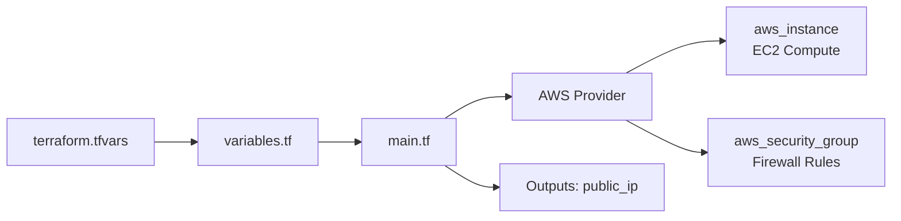

# Terraform AWS Infrastructure as Code Lab

<p align="center">
  
  
  
</p>

---

## 📌 Overview

This repository demonstrates foundational **Infrastructure as Code (IaC)** implementations using **HashiCorp Terraform** targeting **Amazon Web Services (AWS)**. It covers resource declaration, variable parameterization (`variables.tf`), environment overrides (`terraform.tfvars`), state tracking, and output exports.

---

## 🏗️ Architecture & Resources



---

## 📂 Laboratory Structure

```text
.
└── practice/
    ├── main.tf              # AWS provider, EC2 instance, security group definitions
    ├── variables.tf         # Input variable declarations (AMI ID, instance type)
    ├── terraform.tfvars     # Value definitions (e.g. t3.micro, AMI mappings)
    └── outputs.tf           # Exported attributes (public IP, instance IDs)
```

---

## 🚀 Execution Workflow

```bash
# 1. Initialize working directory & download AWS provider plugins
terraform init

# 2. Format and validate configuration syntax
terraform fmt
terraform validate

# 3. Create execution plan
terraform plan

# 4. Apply changes safely
terraform apply
```
